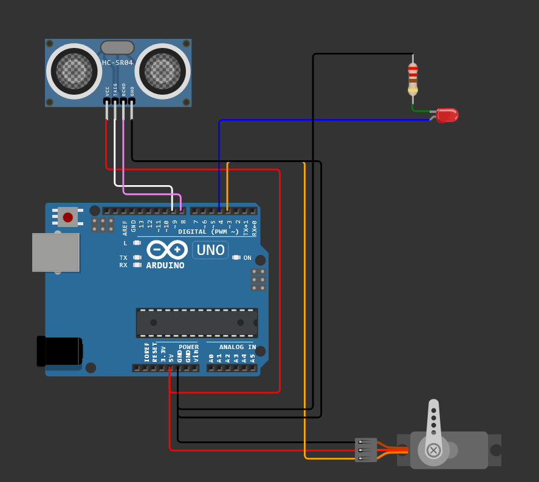

# doorAutoLight
code with an ultrasonic sensor. Which detects when a door is opened and switches on the light.

## dal-s.ino
Version of the code that works with a servo motor that turns to press a button.

### required electronic component
- Arduino
- Motor servo
- ultrasonic sensor
- led (optional)
    - 220Ω resistor (optional)

### Library
- Servo.h

### Variable to change
```cpp
int maxDistance = 10;
int durationAction = 3000
```

### Schema
